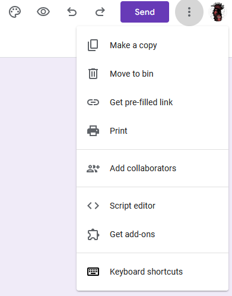

# Google Forms Custom UI  
**Easily Adapt Your Google Form to Match Your Brand's Look and Feel**  

## About  
Google Forms is a fantastic tool for gathering data, but it often lacks the flexibility needed for customization. **Google Forms Custom UI** solves this problem by allowing you to create a fully customized form that mirrors your brand identity, while still leveraging the power of Google Forms for data collection.

This project helps you build a custom user interface for your form while integrating seamlessly with Google Forms. With just a few simple steps, you can style your form, make it match your brand, and collect responses like a pro!

## How to Customize Your Google Form UI
Follow these steps to build a fully customized front-end for your Google Form, while maintaining the powerful data submission process.

### Step-by-Step Guide:
1. **Create a Google Form**  
   - Go to [Google Forms](https://docs.google.com/forms) and create your form with all the questions you want to ask.
   - After you've set up the form, open the preview mode to get the URL. This will be used for submission later.
   - 


2. **Fill the preview form**  
   - Fill in the preview mode form entirely.
   - click on 'Get Link' below the form.
   - Paste the link in you notes app.

2.1: ***Extract the Form's Submission URL***

    Start with the Form URL:
    When you preview your Google Form, the URL will look something like this:

    https://docs.google.com/forms/d/e/1FAIpQLSdabKxN-FOcCQ6ts2UlRhBZevImBigv4P0XcnEsGUyqquxAFw/viewform?usp=pp_url&entry.20089888=Prashely&entry.1785267775....

    Change the URL for Form Submission:
    To make this URL usable for form submission, replace the /viewform part of the URL with /formResponse. This converts the form into a format that can accept POST requests with the form data.

    So, the new URL becomes:
    https://docs.google.com/forms/d/e/1FAIpQLSdabKxN-FOcCQ6ts2UlRhBZevImBigv4P0XcnEsGUyqquxAFw/formResponse

    Use this New URL in Your Custom Form:
    This is the URL your custom HTML form will use as its action attribute. When users submit the custom form, it will send data to Google Forms via this submission URL.

3. **Build Your Custom Form UI**  

   - Using HTML, CSS, and JavaScript, create a custom form interface.
   - For each input field in your HTML, use the `name` attribute to match the Google Form entry IDs (e.g., `name="entry.XXXXX"`). This ensures your custom form sends data to Google Forms.

4. **Set Up an iFrame for Submission**  
   - Use a hidden iFrame to handle form submission. This prevents a full page reload and allows users to stay on your custom form page while the data is sent to Google Forms in the background.
   - On successful submission, you can redirect users to a confirmation page or display a custom message.

5. **Host Your Custom Form**  
   - Deploy your form on your own website or hosting platform, making sure the Google Form link and field IDs are properly set up.

6. **Test Your Form**  
   - Before going live, make sure to test your form by submitting data and checking if it appears in the Google Form’s response sheet.

### Example Code
Check out the project files to see an example of how to integrate your custom UI with Google Forms!

## Technologies Used  
- **HTML** for building the structure of the form  
- **CSS** for styling and making the form match your brand  
- **JavaScript** to handle submission logic  
- **Google Forms** as the backend for data collection

## Installation
1. **Clone the Repository**  
   ```bash
   git clone https://github.com/yourusername/google-forms-custom-ui.git
   ```
2. **Navigate to the Project Directory**  
   ```bash
   cd google-forms-custom-ui
   ```
3. **Edit the HTML Form**  
   - Customize the form fields with your Google Form field IDs, URLs, name attibutes and update the styles to match your brand.

4. **Deploy the Form**  
   - Host the form on your website or any hosting service.

## Contribution  
We welcome contributions from the community! If you have ideas for improvement or want to report a bug, feel free to open an issue or submit a pull request.

1. Fork the repo  
2. Create your feature branch:  
   ```bash
   git checkout -b feature/new-feature
   ```  
3. Commit your changes:  
   ```bash
   git commit -m "Add new feature"
   ```  
4. Push the branch:  
   ```bash
   git push origin feature/new-feature
   ```  
5. Submit a pull request

## License  
This project is free to use in any way. NB replace the form url and name if you clone the app.

## Contact  
If you have any questions or need support, feel free to reach out:  
- **Email**: contact@prashely.com  
- **Website**: [prashely.com](https://prashely.com/)

---
